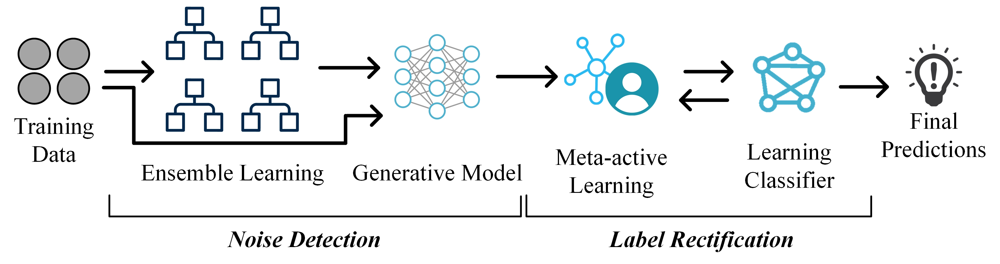

# SmartMendr
Semi-Supervised Ensemble Learning for Dealing with Inaccurate and Incomplete Supervision

Supervised learning refers to the task of inducing a learning function from a set of labeled examples so the function can map between the input (features) and the output (target label) in these training examples. After training, the created model should be able to generalize and correctly predict class labels for unseen data points. Therefore, supervised learning algorithms require large sets of noise-free labeled data to train their models since using data points with noisy or missing class labels can produce distorted models that lead to incorrect predictions. However, obtaining these ideal datasets forms a challenge in most real-world applications. Due to the considerable cost of manual labeling, acquiring fully labeled datasets can be difficult, economically infeasible, or even impossible. Also, since obtaining hand-labeled training data can be prohibitively expensive, practitioners tend to rely on weak supervision to collect labeled datasets. However, low-cost approaches, such as crowdsourcing and user-defined heuristics, produce low-quality annotated data with label noise. 

Therefore, we propose Smart Mendr, a new classification *M*odel that applies *En*semble Learning and *D*ata-driven *R*ectification to handle both scenarios of inaccurate and incomplete supervision. An overview of the proposed method is illustrated in the following figure. As the figure shows, the method has two phases. In the first phase, Smart Mendr applies a preliminary stage of ensemble learning to estimate the probability of each instance being mislabeled and produce initially weak labels for unlabeled data. However, to overcome the challenges of noise detection using ensemble learning, we apply a semi-supervised learning approach to combine the output of the ensemble and report the noisy points. After that, the proposed method, in the second phase, applies a smart correcting procedure using meta-active learning to provide true labels for both noisy and unlabeled points.

## Installation

To install smartMendr, you can clone the Git repository and run:

    pip install -e .

within it.
